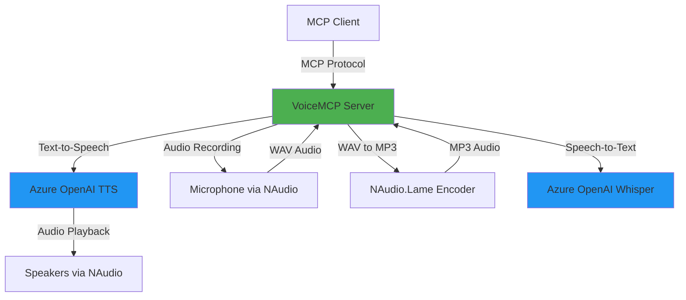

# VoiceMCP - Voice-Enabled Model Context Protocol Server

[](https://opensource.org/licenses/MIT)
[](https://dotnet.microsoft.com/)
[](https://modelcontextprotocol.io)

A **Model Context Protocol (MCP) server** that enables AI agents to interact with users through **voice**, using Azure OpenAI's Text-to-Speech and Whisper speech recognition services. This allows AI assistants to ask questions, request approvals, and receive user input via natural voice conversations.

## 🎯 Features

- **🎤 Voice Input**: Capture user responses via microphone using Azure OpenAI Whisper
- **🔊 Voice Output**: Speak to users using Azure OpenAI Text-to-Speech
- **✅ Confirmation Loops**: Built-in confirmation system to ensure accuracy
- **🔄 Retry Logic**: Automatic retry with user feedback on failed recognitions
- **🎨 Multiple Tools**: Ask questions, request approvals, and more
- **🔐 Flexible Configuration**: Support for both environment variables and user secrets

## 📋 Table of Contents

- [Architecture](#architecture)
- [Prerequisites](#prerequisites)
- [Installation](#installation)
- [Configuration](#configuration)
- [Usage](#usage)
- [Available Tools](#available-tools)
- [Troubleshooting](#troubleshooting)
- [Contributing](#contributing)
- [License](#license)

## 🏗️ Architecture



### Key Components

- **VoiceMCP Server**: MCP server exposing voice-based tools
- **SemanticKernelVoiceService**: Orchestrates TTS and STT using Semantic Kernel
- **NAudio**: Handles audio recording and playback
- **Azure OpenAI**: Provides TTS (Text-to-Speech) and Whisper (Speech-to-Text) services

## 📦 Prerequisites

- **.NET 10.0 SDK** or later
- **Windows OS** (required for NAudio and Windows Speech features)
- **Azure OpenAI Account** with:
  - Text-to-Speech deployment (e.g., `tts-1`)
  - Whisper deployment (e.g., `whisper-1`)
- **Microphone** for voice input
- **Speakers** for audio output

## 🚀 Installation

### Option 1: Install as .NET Tool (Recommended)

Once published to NuGet, install globally:

```bash
# Install the tool globally
dotnet tool install --global VoiceMCP

# The tool will be available as 'voicemcp' command
voicemcp
```

### Option 2: Build from Source

1. **Clone the Repository**:
   ```bash
   git clone https://github.com/tamirdresher/mcp-voice-assist.git
   cd mcp-voice-assist
   ```

2. **Restore Dependencies**:
   ```bash
   dotnet restore VoiceMCP.sln
   ```

3. **Build the Project**:
   ```bash
   dotnet build VoiceMCP.sln --configuration Release
   ```

## ⚙️ Configuration

VoiceMCP supports two configuration methods:

### Option 1: Environment Variables (Recommended for MCP Clients)

Set these environment variables before running:

```bash
# Windows PowerShell
$env:AZURE_OPENAI_ENDPOINT = "https://your-resource.openai.azure.com/"
$env:AZURE_OPENAI_API_KEY = "your-api-key"
$env:AZURE_OPENAI_DEPLOYMENT = "gpt-4"
$env:AZURE_OPENAI_TTS_DEPLOYMENT = "tts-1"
$env:AZURE_OPENAI_WHISPER_DEPLOYMENT = "whisper-1"
```

Or use the provided setup script:

```powershell
.\setup-azure-openai-env.ps1
```

### Option 2: User Secrets (For Development)

```bash
cd VoiceMCP
dotnet user-secrets set "AzureOpenAI:Endpoint" "https://your-resource.openai.azure.com/"
dotnet user-secrets set "AzureOpenAI:ApiKey" "your-api-key"
dotnet user-secrets set "AzureOpenAI:DeploymentName" "gpt-4"
dotnet user-secrets set "AzureOpenAI:TtsDeploymentName" "tts-1"
dotnet user-secrets set "AzureOpenAI:WhisperDeploymentName" "whisper-1"
```

Or use the setup script:

```powershell
.\setup-azure-secrets.ps1
```

### MCP Client Configuration

#### Using Installed Tool

Add VoiceMCP to your MCP client configuration:

```json
{
  "mcpServers": {
    "voice-mcp": {
      "command": "voicemcp",
      "env": {
        "AZURE_OPENAI_ENDPOINT": "https://your-resource.openai.azure.com/",
        "AZURE_OPENAI_API_KEY": "your-api-key",
        "AZURE_OPENAI_TTS_DEPLOYMENT": "tts-1",
        "AZURE_OPENAI_WHISPER_DEPLOYMENT": "whisper-1"
      }
    }
  }
}
```

#### Using Source Code

```json
{
  "mcpServers": {
    "voice-mcp": {
      "command": "dotnet",
      "args": [
        "run",
        "--no-build",
        "--project",
        "C:/path/to/mcp-voice-assist/VoiceMCP/VoiceMCP.csproj"
      ],
      "env": {
        "AZURE_OPENAI_ENDPOINT": "https://your-resource.openai.azure.com/",
        "AZURE_OPENAI_API_KEY": "your-api-key",
        "AZURE_OPENAI_TTS_DEPLOYMENT": "tts-1",
        "AZURE_OPENAI_WHISPER_DEPLOYMENT": "whisper-1"
      }
    }
  }
}
```

## 🤝 Contributing

Contributions are welcome! Please see [`CONTRIBUTING.md`](CONTRIBUTING.md) for guidelines.

### Development Setup

1. Clone the repository
2. Open `VoiceMCP.sln` in Visual Studio or VS Code
3. Configure user secrets (see Configuration section)
4. Build and run

## 📄 License

This project is licensed under the MIT License - see the [LICENSE](LICENSE) file for details.

## 🙏 Acknowledgments

- [Model Context Protocol](https://modelcontextprotocol.io) - MCP specification
- [Semantic Kernel](https://github.com/microsoft/semantic-kernel) - AI orchestration framework
- [NAudio](https://github.com/naudio/NAudio) - Audio library for .NET
- [Azure OpenAI Service](https://azure.microsoft.com/products/ai-services/openai-service) - AI services

## 📧 Support

For issues, questions, or contributions:
- Open an issue on GitHub
- Check existing documentation in the `/docs` folder
- Review troubleshooting section above

---

**Made with ❤️ for voice-enabled AI interactions**